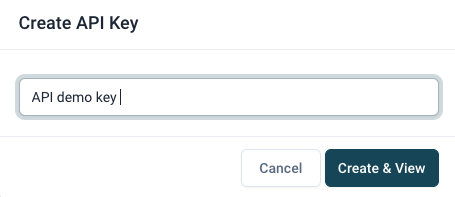

## Getting started

### Configuring EUmail

This configuration guide asumes that you have already created and activated your EUmail account and are logged in. If that is not the case, then click the following link to create your new account.

[Click here to create a EUmail account]("https://app.mandaa.io/signup")

### Domain definition

The following guide assumes that you already have a domain that you own - for example mydomain.com - and that you want to sent transactional email from this domain as for example [sales@mydomain.com]("mailto:sales@mydomain.com") . You need to control DNS for the domain you want to use, so you cannot use domains than belong to others like gmail.com or hotmail.com.

If you do not have a domain then you will need to aquire this online before you continue.

Go to [EUmail domains page]("https://app.mandaa.io/domains")

Click on the button in the upper right corner to add a domain .

A dialog box will open like this:

Fill in your domain name. It must be a domain that you own and that exists already on the internet. Now click the button “Add domain” and your domain will have been created (defined) within EUmail.

We recommend that you keep the default selection to create SPF and DKIM records.

#### SPF

An SPF record is a specially formatted string of information that helps prevent SPAM. It basically tells the world who (what servers) that are allowed to send emails from your domain. Most email servers will reject emails sendt from servers that are not mentioned in an SPF record or mark the emails as SPAM. A missing SPF record will also cause many email servers to mark mails from your domain as spam.


If your domain does not already have an SPF record then you must create it first. We recommend that you ask you IT department or IT service provider for help if you are unsure on how to do this. The company hosting your domain may also have a guide on how to setup SPF. The Internet also provide much information on this proces. You are also welcome to reach out to our support.



Below you will find an example of the SPF record created in EUmail for mandaa.io in the DNS system

“v=spf1 a:support.mandaa.io include:eum39250.mandaa.io include:_spf.google.com -all”

As you can see we have included a special part (displayed in green) that tells the world that EUmail can send mails on behalf of the mandaa.io domain.

In the image below we have highlighed the part to include in the SPF. When you create your domain, in your account, EUmail will display a similar text but with a different number. You must use the number from your account when you create your SPF record.


You can find free online tools on the Internet that will test if your SPF is setup correctly.


#### DKIM

DomainKeys Identified Mail (DKIM) is another method of preventing SPAM being sent from your domain as is allows the recipients to detect if the email comes from af forged sender, which is often the case for SPAM and email phishing.

When you configure your domain in EUmail a DKIM record will also be created. You can see an example of the DKIM record for mandaa.io below.

You must define the first part of the FROM email name and then select your domain from the drop down list.

The FROM email is the email address (within your domain) that emails are sendt from. Examples of popular names are “customerservice”, “support”, “sales” etc. When you have entered your from name and selected the domain, then click the “Update” button.

#### FROM (name)
In the FROM (name) you can write a clear text name that will be displayed to the recipient in stead of the FROM (email) address.

#### Reply to

Reply to is used when a recipient wants to reply to the email received. Default is to reply to the senders email (FROM field), but you can define another email here if you like.

#### BCC
If you put an email into the BCC field then EUmail will send a copy of all emails to the BCC address. Emails sent to BCC have their own events and tracking.

#### Track open emails
When enabled EUmail will try to track if the emails you send are opened. Some email clients will try to block tracking, so an email can have been opened even that EUmail does not display this.

#### API token

Go to the menu and select the API keys menu or click here [API keys]("https://app.mandaa.io/integrations/api_tokens") Click the “Create API Key” button and enter the API key name – for example “API demo key”. Then click the “Create & View”

button  You will now be shown a message saying that that the key has been generated. Copy the key using the copy button and keep it safe as it is needed later. You will not be able to see it again ever in EUmail, but you can always make a new one if you loose the key.

### Next step

That’s it as far as configuration goes. Now you will probably need to create yourself a template so that you can try sending emails - unless of course that you choose to provide the email HTML in your API request.

Next step:

- Go to our [Quick start](/documentation/getting-started/first_email_via_api/) and send an email via command line
- Create a [new template](/documentation/templates/eumail_templates/) and send an email from our editor
- Try out EUmail from [Zapier](/documentation/integrations/zapier/)

## Problems or questions?

If you have any problems or questions then please don’t hessitate to contact our support at [support@mandaa.io](mailto:support@mandaa.io) . Support on getting started is FREE!


On WikiPedia you can read more about [DNS](https://en.wikipedia.org/wiki/Domain_Name_System) , [SPF](https://en.wikipedia.org/wiki/Sender_Policy_Framework) and [DKIM](https://en.wikipedia.org/wiki/DomainKeys_Identified_Mail) .
